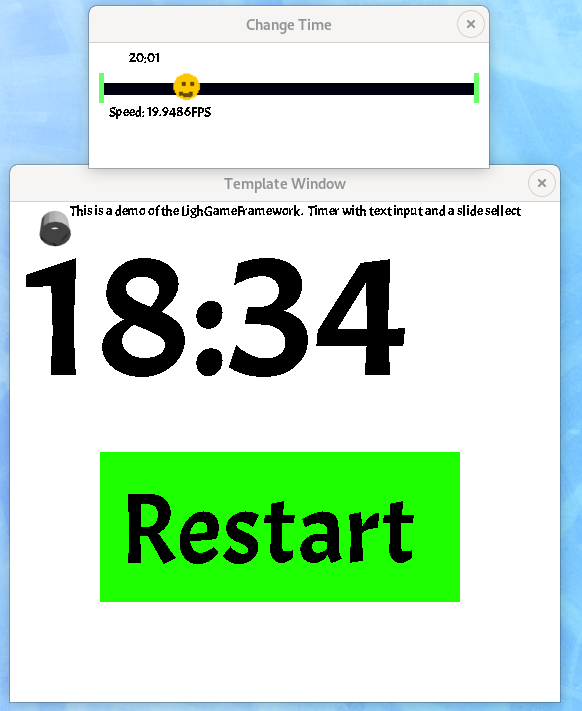
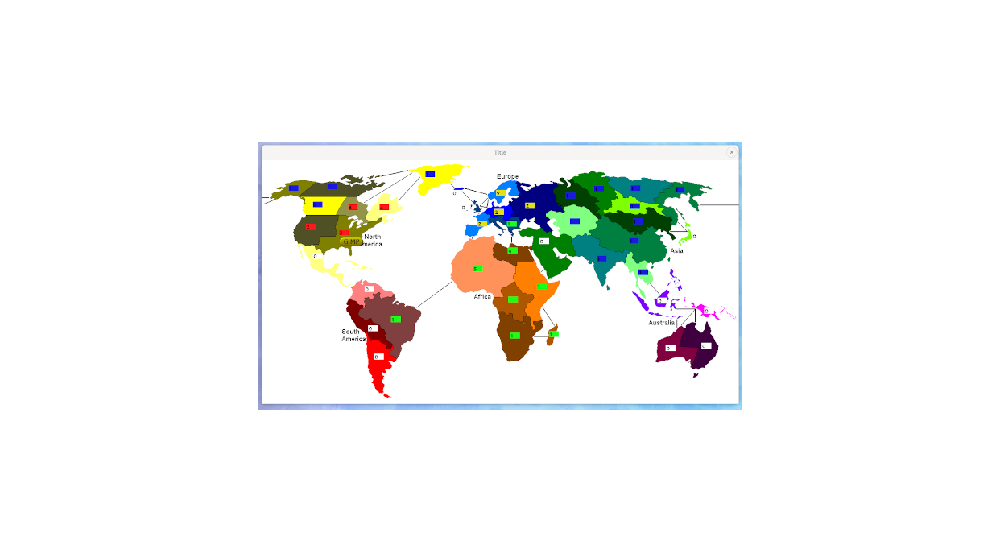
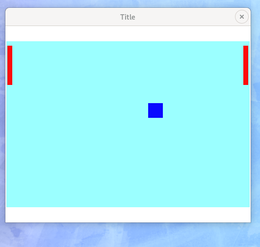

# LightGameFramework
An RPG framework ontop SDL2, generally a hobby project, Creative Commons license.

## TO DO:
text input - with option for int or float only inputs. 

Better buttons [perhaps figure out callbacks? Or a simple option of accepting a group as a button is likely to need access to an item in said group, or even affect multiple items in said group... seems a way to pass multiple args?]
vertical/horizontal scroll-bar
Layouts [to make buttons/items align based on a parent item]
Hardware acceleration [let's get beyond SDL_Surface as our base drawing unit]
Split-screen for VR?
Haptics/joystick?
Wifi multiplayer?

## Here's some things I've created with the framework so far
### A Pomodoro timer

### A small board game (Risk)

### Pong with option of 1 or 2 players

## Some more demos
I use these demos as my proof of concept area, so it's probably a good idea to add more variety to them.
Obviously the next demo should be a paint program. 
